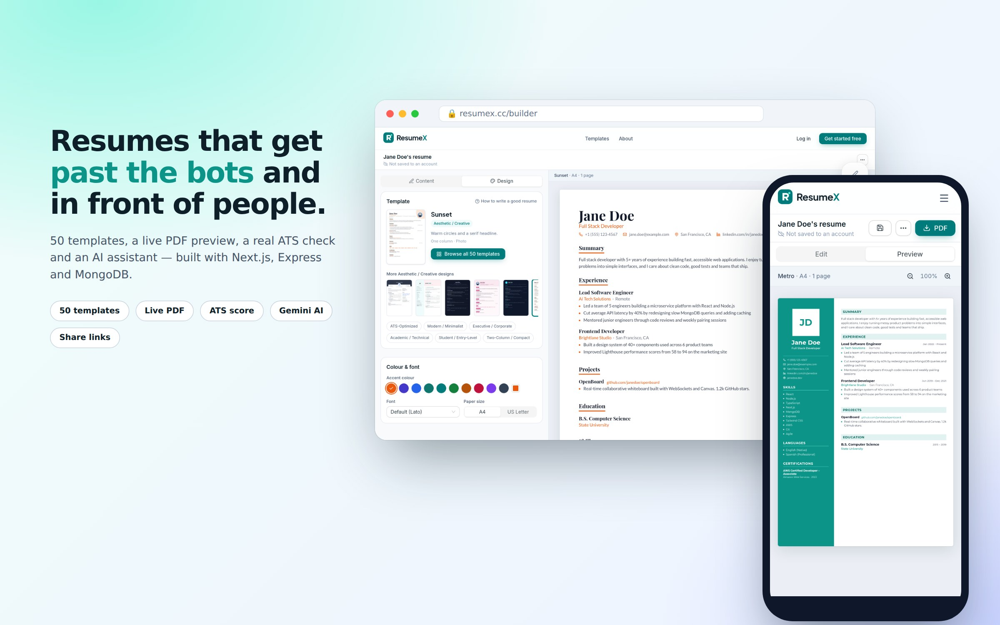
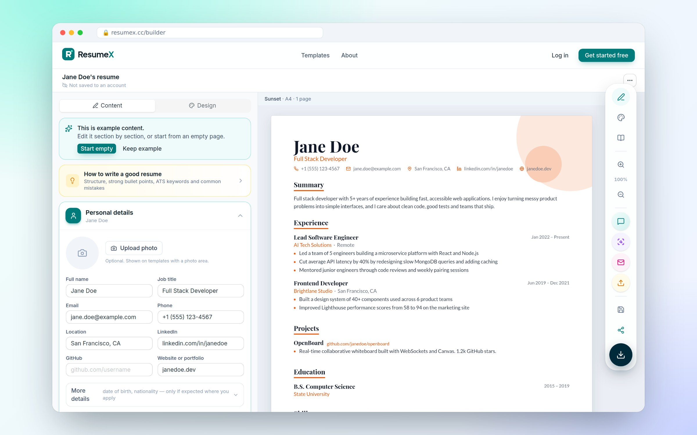
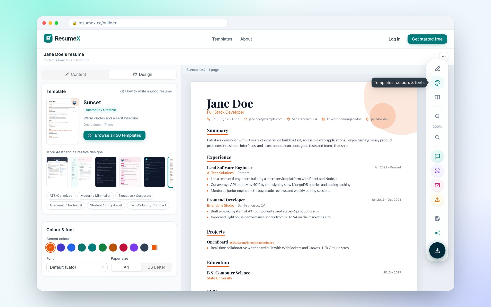
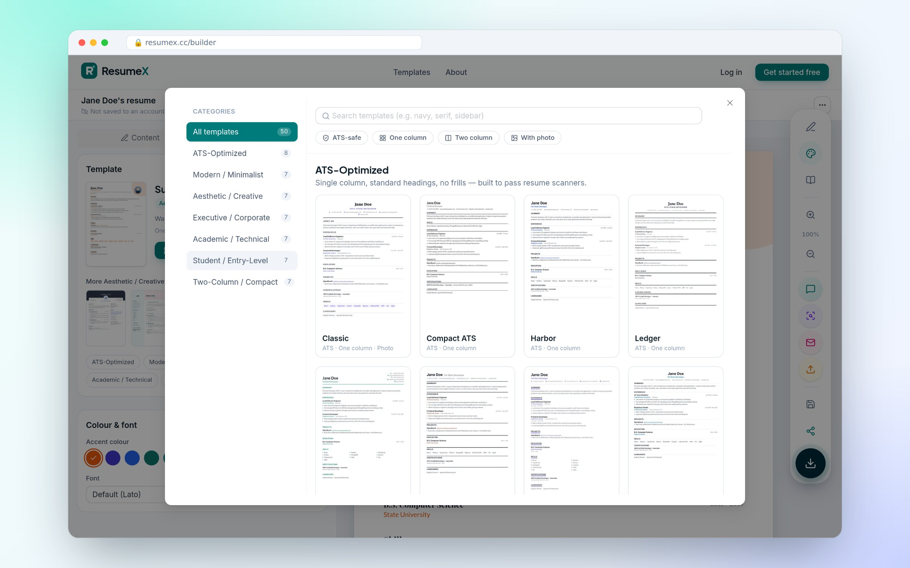
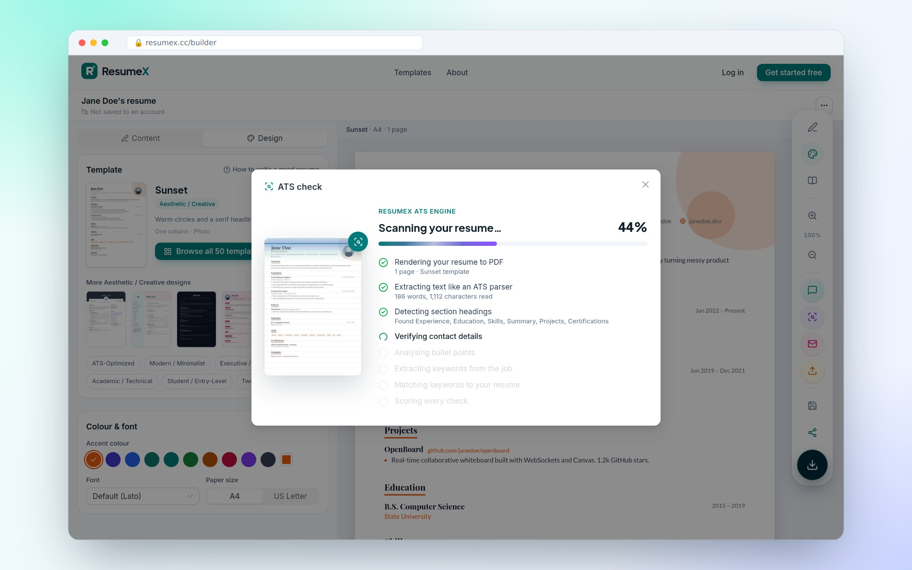
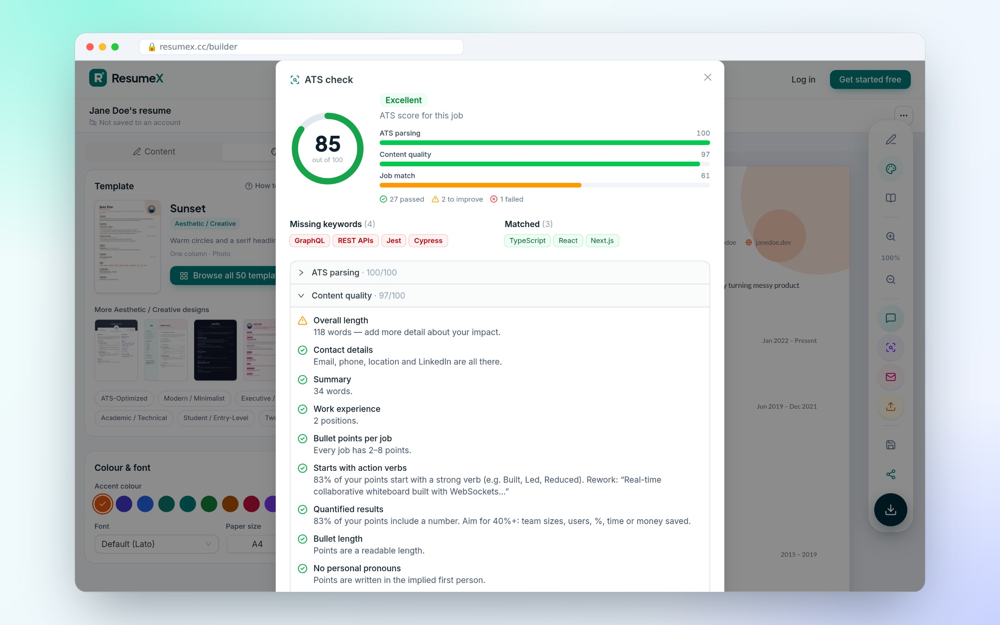
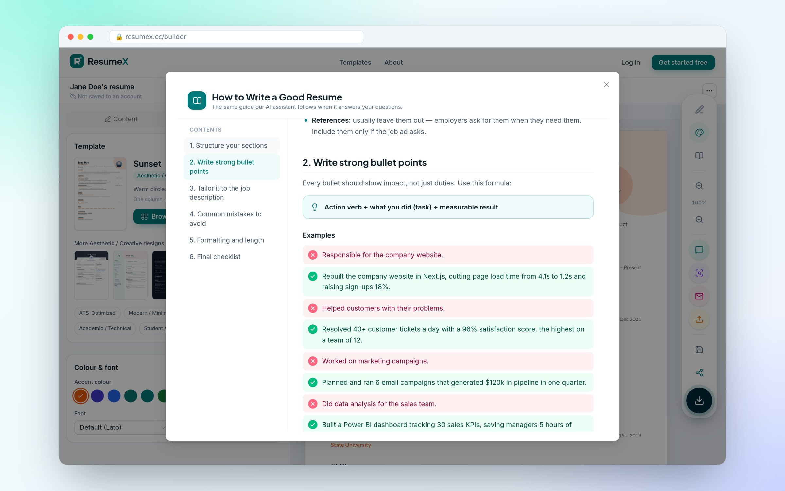
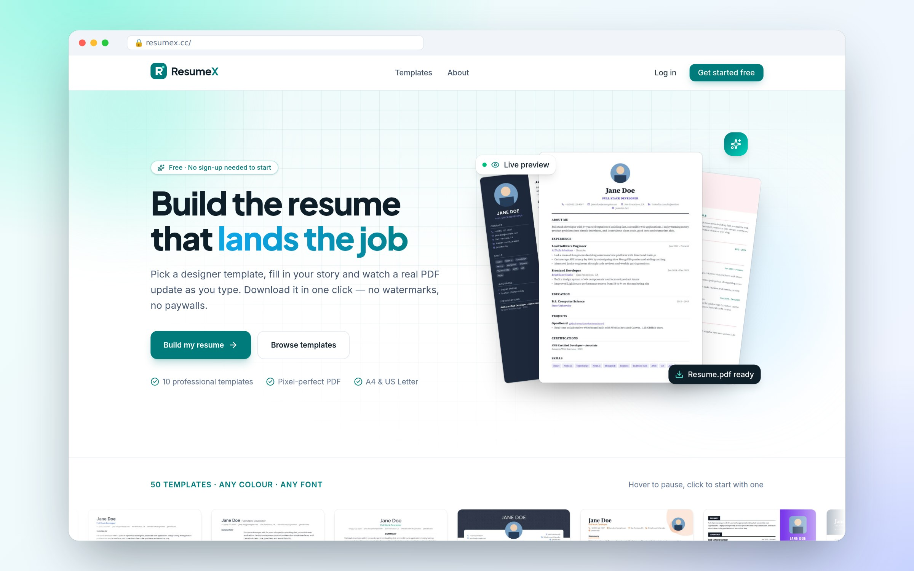
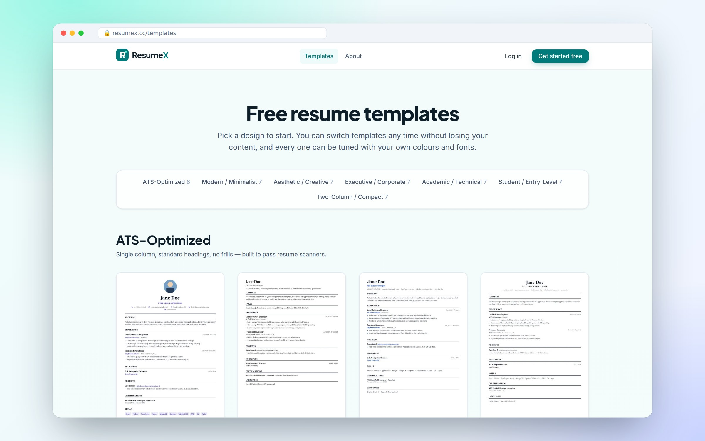
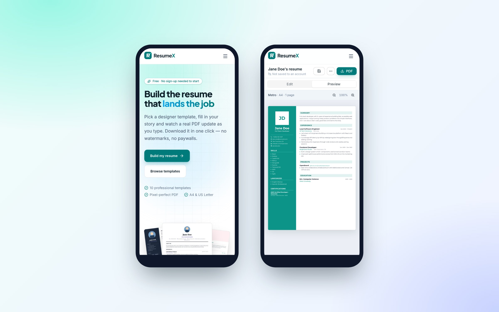

<div align="center">

# ResumeX

**Resumes that get past the bots and in front of people.**

50 designer templates · a live, pixel-perfect PDF preview · a real ATS check · an AI resume assistant

[**resumex.cc**](https://resumex.cc) &nbsp;·&nbsp; Next.js 16 · React 19 · Express · MongoDB · Gemini



</div>

---

## Why ResumeX

Most resume builders render HTML in the browser and hope the print dialog behaves. ResumeX renders the **actual PDF** on every keystroke, so what you see is byte-for-byte what you download and what an applicant tracking system reads. On top of that sits an ATS checker that reads your PDF back the way real parsers do, instead of guessing.

## Highlights

### A builder where the preview *is* the PDF
The preview is the real document, rendered with `@react-pdf/renderer` in a Web Worker and painted with pdf.js. Page breaks, fonts and spacing are exactly what you download. Content and design live side by side, with a floating action dock for zoom, AI, save, share and download.



### 50 templates in 7 categories
ATS-Optimized, Modern / Minimalist, Aesthetic / Creative, Executive / Corporate, Academic / Technical, Student / Entry-Level and Two-Column / Compact. Ten are hand-built; forty come from a spec-driven template engine (layouts, headers, heading styles, sidebars, photos, palettes and fonts described as data). Any template works with any accent colour, ten fonts, and A4 or US Letter.




### An ATS check that isn't a hoax
It renders your real PDF, extracts the text like an ATS, and runs 30+ explainable checks: readable name and contacts, standard headings, reading order, dates, action verbs, quantified results, clichés, length. Paste a job description to get weighted keyword matching (required vs nice-to-have), skills backed by experience, and title, years and degree fit. It's deterministic, runs in the browser and needs no AI.

| Staged scan | Results |
| --- | --- |
|  |  |

### Guidance built in, and an AI grounded in it
A **How to Write a Good Resume** guide lives in the builder. The same Markdown file (`shared/resume-guide.md`) is injected into the Gemini assistant's system prompt, so its advice matches the guide. The AI can also rewrite bullets, write cover letters and import an existing PDF or DOCX. Imports are transcribed exactly first, then mapped to the resume model.



### Plans, credits and an admin console
Every AI feature costs credits, and each account has a daily or monthly allowance. A super admin (set with `SUPERADMIN_EMAILS`) runs everything from **/admin** without a deploy:
- **Overview:** users, sign-ups, resumes and AI credit usage per day and per feature.
- **Users:** search, change plan and plan end date, set a custom credit allowance, restore credits, reset passwords, ban, add, delete and export to CSV.
- **Plans & pricing:** names, monthly and yearly prices, credits and included features for the three tiers, plus the perks shown on `/pricing`.
- **Credits & access:** the credit cost of each AI feature, **free mode** (everything open with a daily allowance, on by default), and who can sign up (anyone, campaign codes only, or nobody).
- **Campaigns:** invite codes like `/join/NSU2026` that give a plan and credits to a limited number of people, optionally limited to one email domain.

Users see what each AI action costs in its tooltip, and their balance in the builder's top bar.

### Everything else
- **Photo cropper**: drag, zoom and re-crop at any time.
- **Every section**: experience, education, projects, skills, certifications, languages, volunteering, awards, publications, courses, interests and custom sections. References can carry signature lines for printed copies.
- **Share links**: `/view/<id>` shows the resume in its own template. Shared resumes are kept out of search results.
- **Accounts**: autosave, a dashboard with live thumbnails, a master profile, password reset, data export and account deletion.
- **Works without an account**: guests can build and download.
- **SEO-first marketing site**: a page for every template and template style, career guides, an ATS checker landing page, full sitemap, canonical URLs and JSON-LD (Organization, SoftwareApplication, Article, FAQ, ItemList, breadcrumbs). See [`docs/marketing/seo-checklist.md`](docs/marketing/seo-checklist.md).
- **Marketing kit**: a 90-day plan, ready-to-post Facebook posts and social graphics in [`docs/marketing`](docs/marketing).

| Landing page | Template library |
| --- | --- |
|  |  |



---

## Architecture

```text
Browser ──► Next.js (Vercel)                 ──► Express API (Cloud Run) ──► MongoDB Atlas
            • App Router pages + SEO             • JWT auth, resumes, share      • users, resumes, usage
            • builder UI (antd + Tailwind)       • rate limits per account
            • PDF engine in a Web Worker         • Gemini: chat, refine, cover letter, import
            • ATS analyzer (client-side)         • password reset email (SMTP)
```

| Layer | Stack |
| --- | --- |
| Front end | Next.js 16 (App Router, Turbopack), React 19, Ant Design 6, Tailwind CSS 4, Motion |
| PDF | @react-pdf/renderer (Web Worker), pdf.js preview, self-hosted fonts |
| API | Node 22, Express, Mongoose, JWT, bcrypt, Nodemailer |
| AI | Google Gemini (Flash, automatic fallback model) |
| Infra | Vercel (web), Google Cloud Run (API, `Dockerfile`), MongoDB Atlas |

**Security:**
- **Two-factor authentication:** authenticator apps (TOTP). It's mandatory for admins, and super admins must also verify their email. Two-factor secrets are AES-256-GCM encrypted at rest; recovery codes are hashed and single-use; used codes can't be replayed.
- **Sessions:** 14 days for users and 12 hours for admins, with pinned JWT algorithms. Password changes, 2FA changes, bans and "sign out everywhere" revoke every other session.
- **Rate limits** on every route (per IP and per account), including login, 2FA, password reset, campaign lookups, public pages, AI and admin.
- **Private sessions:** nothing is stored on the server or in the browser. You can save to or open from a local `.resumex.json` file.
- **Admin audit log:** every admin action and admin security event is recorded (secrets masked).
- **Hardening:**
  - A strict Content Security Policy, HSTS, `frame-ancestors 'none'` and `no-store` on API responses.
  - MongoDB operator stripping on all input, and uploads checked by content (PDF/DOCX magic bytes).
  - Photos restricted to PNG/JPEG/WebP data URLs, and timing-safe login.

---

## Getting started

Requires **Node.js 20+** and a MongoDB database (local or Atlas).

```bash
# API
cd server
npm install
cp .env.example .env      # set MONGO_URI and JWT_SECRET (32+ chars in production)
npm run dev               # http://localhost:5000

# Web
cd client
npm install
cp .env.example .env.local
npm run dev               # http://localhost:3000
```

| Client variable | Purpose |
| --- | --- |
| `NEXT_PUBLIC_API_URL` | API base URL, including `/api` |
| `NEXT_PUBLIC_SITE_URL` | Public site URL (canonical links, sitemap, share links) |
| `NEXT_PUBLIC_AI_ENABLED` | `true` to enable AI features |
| `NEXT_PUBLIC_CONTACT_EMAIL` | Shown on the privacy and terms pages |
| `NEXT_PUBLIC_GOOGLE_SITE_VERIFICATION` | Optional. Google Search Console HTML-tag value |
| `NEXT_PUBLIC_BING_SITE_VERIFICATION` | Optional. Bing Webmaster Tools meta-tag value |

All server settings (Gemini, SMTP, rate limits, CORS) are documented in [`server/.env.example`](server/.env.example).

Production security settings on the API: `SUPERADMIN_EMAILS` (your email), `ENCRYPTION_KEY` (32+ random characters, set once and never change it), and `INTERNAL_API_KEY` (also set on Vercel as a server-only variable so share and invite pages rate-limit per visitor).

## Deploying

- **Web → Vercel**: root directory `client`; set the variables above.
- **API → Google Cloud Run**: built from the root `Dockerfile`, with continuous deploy from GitHub. Step-by-step guide: [`docs/deploy-cloud-run.md`](docs/deploy-cloud-run.md).
- **Database → MongoDB Atlas**: the free M0 tier is enough to start.

## Project structure

```text
cse299/
├── client/                    # Next.js app
│   ├── public/fonts/          # fonts embedded in PDFs
│   ├── public/templates/      # template thumbnails
│   └── src/
│       ├── app/               # (site) marketing, (app) builder/dashboard/account, view/[id]
│       ├── components/        # builder, public view, account, UI
│       ├── lib/ats/           # deterministic ATS analyzer
│       └── pdf/               # PDF engine: templates/, engine/ (spec-driven), blocks, worker
├── server/                    # Express API: routes, models, lib (rate limits, mailer, import)
├── shared/resume-guide.md     # guide shown in the builder and fed to the AI
├── docs/                      # deploy guide and screenshots
└── Dockerfile                 # API container
```

## Contributors

- **Mehboob Ehsan Khan** · [@omikhan4901](https://github.com/omikhan4901)
- **Nabigah Bin Sayeed** · [@Nabigah274](https://github.com/Nabigah274)

Started as a CSE299 project at North South University.
