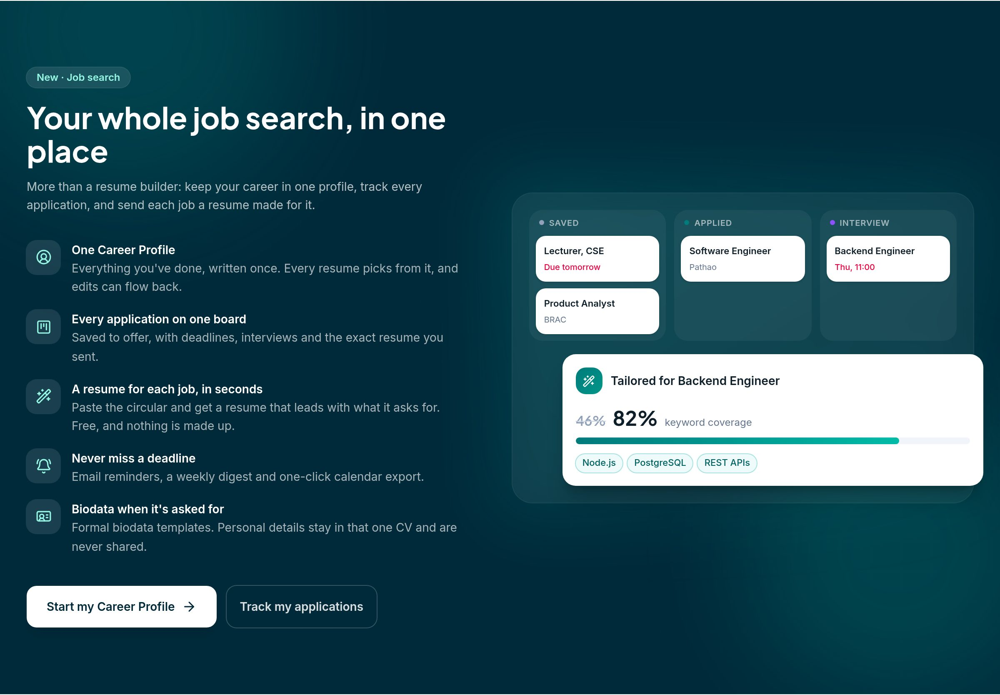
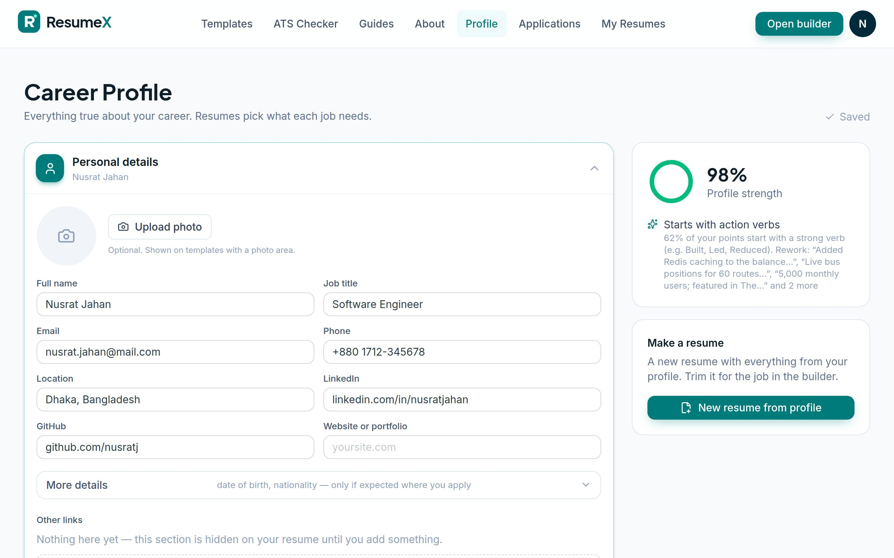
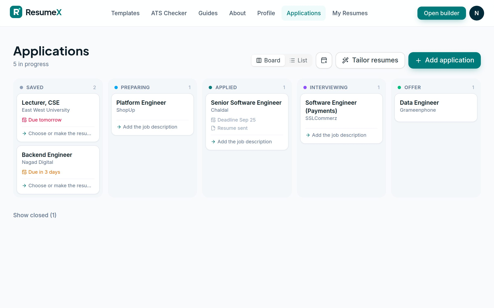
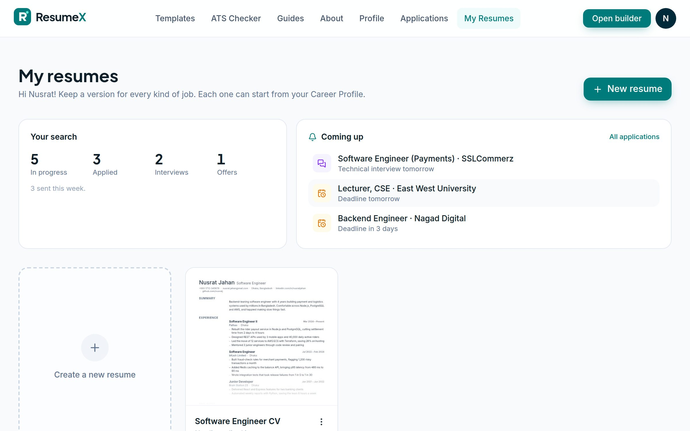
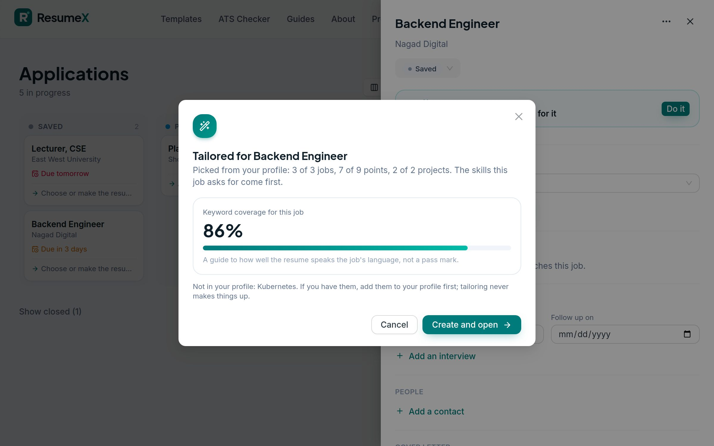

<div align="center">

# ResumeX

**Resumes that get past the bots and in front of people.**

50+ designer templates · a live, pixel-perfect PDF preview · a real ATS check · an AI resume assistant<br>
**New:** a Career Profile · an application tracker · a tailored resume for every job

[**resumex.cc**](https://resumex.cc) &nbsp;·&nbsp; Next.js 16 · React 19 · Express · MongoDB · Gemini


</div>

---

## Why ResumeX

Most resume builders render HTML in the browser and hope the print dialog behaves. ResumeX renders the **actual PDF** on every keystroke, so what you see is byte-for-byte what you download and what an applicant tracking system reads. On top of that sits an ATS checker that reads your PDF back the way real parsers do, instead of guessing.

**V2** turns it into a job-search workspace: write your career once, track every application, and send each job a resume picked for it. Two rules run through all of it: **deterministic first** (tailoring, job capture and matching use no AI) and **the AI proposes, you approve** (every AI change is shown for review and never invents experience).

## V2: your whole job search

> Built behind an admin **V2 preview** switch: admins and chosen accounts see it now, and one switch (Admin › Plans › *V2 workspace for everyone*) opens it to all. The plan and its status live in [`docs/v2/`](docs/v2).



### A Career Profile: write it once
Everything true about your career in one place, in the same shape as a resume, so the builder's editors, ATS checks and PDF engine work on it unchanged. New resumes are made from it in one click; **Pull updates** brings profile changes into an old resume and **Save to profile** sends a great new bullet point back (items remember where they came from). A profile-strength panel says what to add next, and **Add anything** turns pasted text into proposed changes you approve one by one.



### An application board
Saved → preparing → applied → interviewing → offer (and rejected, withdrawn, no response). Paste a job circular or a link and the deadline, salary, location and how to apply are read out of it, with no AI: tested on 20 real Bangladeshi circulars. Link fetching only reaches public addresses, has size and time limits, and never touches LinkedIn. When you mark a job applied, the exact resume you sent is frozen with it. Deadlines and interviews export to any calendar (`.ics`), and email reminders and a weekly digest keep you on time.

| Board | Coming up |
| --- | --- |
|  |  |

### A resume for every job, in seconds
Tailoring scores every job, point and project in your profile against the job's keywords (with a little weight for recent work), keeps the best within one or two pages, puts the skills the job asks for first and picks the summary that fits. It shows your keyword coverage before and after, offers one-click **include** for skills your profile has, and says plainly which skills you don't have. Several jobs can be tailored at once, with an optional AI polish that only leaves suggestions to review.



### And around it
- **Biodata CVs:** two formal biodata templates. Parents' names, addresses and the rest stay in that one resume: never in the profile, never sent to AI, never on share links, and no national ID field.
- **Rewrite and Strengthen:** the assistant rewrites a point and flags anything it couldn't verify; Strengthen asks you questions instead of guessing numbers.
- **Job Search Pass:** one payment for a plan for a set number of days, beside the Pro and Premium subscriptions. Days are added once however often Paddle retries, and a refund ends the pass.
- **Plan limits** for tracked jobs, tailored resumes and batch size, all set in the admin console and shown on the pricing page.
- **AI economics:** every AI call records its model and tokens; an admin tab shows AI cost against revenue per paying user. AI can run on Gemini directly or through **Vertex AI** (`AI_PROVIDER=vertex`).

---

## Highlights

### A builder where the preview *is* the PDF
The preview is the real document, rendered with `@react-pdf/renderer` in a Web Worker and painted with pdf.js. Page breaks, fonts and spacing are exactly what you download. Content and design live side by side, with a floating action dock for zoom, AI, save, share and download.


### 52 templates in 7 categories
ATS-Optimized (including two biodata layouts), Modern / Minimalist, Aesthetic / Creative, Executive / Corporate, Academic / Technical, Student / Entry-Level and Two-Column / Compact. A handful are hand-built; the rest come from a spec-driven template engine (layouts, headers, heading styles, sidebars, photos, palettes and fonts described as data). Any template works with any accent colour, ten fonts, and A4 or US Letter.


### An ATS check that isn't a hoax
It renders your real PDF, extracts the text like an ATS, and runs 30+ explainable checks: readable name and contacts, standard headings, reading order, dates, action verbs, quantified results, clichés, length. Paste a job description to get weighted keyword matching (required vs nice-to-have), skills backed by experience, and title, years and degree fit. It's deterministic, runs in the browser and needs no AI.

| Staged scan | Results |
| --- | --- |
|  |  |

### Guidance built in, and an AI grounded in it
A **How to Write a Good Resume** guide lives in the builder. The same Markdown file (`shared/resume-guide.md`) is injected into the Gemini assistant's system prompt, so its advice matches the guide. The AI can also rewrite bullets, write cover letters and import an existing PDF or DOCX. Imports are transcribed exactly first, then mapped to the resume model.


### Plans, credits and an admin console
Every AI feature costs credits, and each account has a daily or monthly allowance. A super admin (set with `SUPERADMIN_EMAILS`) runs everything from **/admin** without a deploy:
- **Overview:** users, sign-ups, resumes, AI credit usage per day and per feature, and job-search adoption (Career Profiles, applications tracked, tailored resumes).
- **Users:** search, change plan and plan end date, give V2 preview access, set a custom credit allowance, restore credits, reset passwords, ban, add, delete and export to CSV.
- **Plans & pricing:** names, monthly and yearly prices, credits, included features and V2 limits for the three tiers, the perks shown on `/pricing`, the Job Search Pass and the V2 switches.
- **Economics:** AI cost by model and feature, revenue, and cost per paying user, from real token counts.
- **Credits & access:** the credit cost of each AI feature, **free mode** (everything open with a daily allowance, on by default), and who can sign up (anyone, campaign codes only, or nobody).
- **Campaigns:** invite codes like `/join/NSU2026` that give a plan and credits to a limited number of people, optionally limited to one email domain.

Users see what each AI action costs in its tooltip, and their balance in the builder's top bar.

### Everything else
- **Photo cropper**: drag, zoom and re-crop at any time.
- **Every section**: experience, education, projects, skills, certifications, languages, volunteering, awards, publications, courses, interests and custom sections. References can carry signature lines for printed copies.
- **Share links**: `/view/<id>` shows the resume in its own template. Shared resumes are kept out of search results.
- **Accounts**: autosave with revisions and conflict handling, a dashboard with live thumbnails, password reset, email preferences, data export and account deletion (which covers the profile, applications and reminders too).
- **Works without an account**: guests can build and download.
- **SEO-first marketing site**: a page for every template and template style, career guides, an ATS checker landing page, full sitemap, canonical URLs and JSON-LD (Organization, SoftwareApplication, Article, FAQ, ItemList, breadcrumbs). See [`docs/marketing/seo-checklist.md`](docs/marketing/seo-checklist.md).
- **Marketing kit**: a 90-day plan, ready-to-post Facebook posts and social graphics in [`docs/marketing`](docs/marketing).

| Landing page | Template library |
| --- | --- |
|  |  |


---

## Architecture

```text
Browser ──► Next.js (Vercel)                 ──► Express API (Cloud Run) ──► MongoDB Atlas
            • App Router pages + SEO             • JWT auth, resumes, share      • users, resumes, usage
            • builder UI (antd + Tailwind)       • rate limits per account
            • PDF engine in a Web Worker         • Gemini or Vertex AI: chat, refine, polish, import
            • ATS analyzer (client-side)         • password reset and reminder email (SMTP)
            • tailoring, job capture, matching   • Paddle billing, Job Search Pass
              (pure JS, shared with the tests)   • /internal/reminders ◄── Cloud Scheduler
```

| Layer | Stack |
| --- | --- |
| Front end | Next.js 16 (App Router, Turbopack), React 19, Ant Design 6, Tailwind CSS 4, Motion |
| PDF | @react-pdf/renderer (Web Worker), pdf.js preview, self-hosted fonts |
| API | Node 22, Express, Mongoose, JWT, bcrypt, Nodemailer, Paddle Billing |
| AI | Google Gemini (Flash, automatic fallback model), directly or through Vertex AI |
| Infra | Vercel (web), Google Cloud Run (API, `Dockerfile`), MongoDB Atlas |

**Security:**
- **Two-factor authentication:** authenticator apps (TOTP). It's mandatory for admins, and super admins must also verify their email. Two-factor secrets are AES-256-GCM encrypted at rest; recovery codes are hashed and single-use; used codes can't be replayed.
- **Sessions:** 14 days for users and 12 hours for admins, with pinned JWT algorithms. Password changes, 2FA changes, bans and "sign out everywhere" revoke every other session.
- **Rate limits** on every route (per IP and per account), including login, 2FA, password reset, campaign lookups, public pages, AI and admin.
- **Private sessions:** nothing is stored on the server or in the browser. You can save to or open from a local `.resumex.json` file.
- **Admin audit log:** every admin action and admin security event is recorded (secrets masked).
- **Hardening:**
  - A strict Content Security Policy, HSTS, `frame-ancestors 'none'` and `no-store` on API responses.
  - MongoDB operator stripping on all input, and uploads checked by content (PDF/DOCX magic bytes).
  - Photos restricted to PNG/JPEG/WebP data URLs, and timing-safe login.

---

## Getting started

Requires **Node.js 20+** and a MongoDB database (local or Atlas).

```bash
# API
cd server
npm install
cp .env.example .env      # set MONGO_URI and JWT_SECRET (32+ chars in production)
npm run dev               # http://localhost:5000

# Web
cd client
npm install
cp .env.example .env.local
npm run dev               # http://localhost:3000
```

### Payments (Paddle)

Set these on the **API** (Cloud Run). The site gets the public parts (environment, client token, price IDs) from the API, so Vercel needs nothing extra.

| API variable | Purpose |
| --- | --- |
| `PADDLE_ENV` | `sandbox` or `production`. Required; never assumed |
| `PADDLE_API_KEY` | Server-side API key (Developer tools › Authentication) |
| `PADDLE_WEBHOOK_SECRET` | Signing secret of the notification destination pointing at `https://<api>/api/paddle/webhook` |
| `PADDLE_CLIENT_TOKEN` | Client-side token for Paddle.js (`test_…` for sandbox, `live_…` for production) |
| `PADDLE_PRICE_PRO_MONTH`, `PADDLE_PRICE_PRO_YEAR`, `PADDLE_PRICE_PREMIUM_MONTH`, `PADDLE_PRICE_PREMIUM_YEAR` | The `pri_…` IDs of the four prices |
| `PADDLE_PRICE_PASS` | Optional. A one-time price for the Job Search Pass (turn the pass on in Admin › Plans) |

Webhooks mirror subscriptions into MongoDB and set each account's plan: active, trialing and past-due subscriptions give access; paused and canceled ones end it (a cancellation scheduled for the end of the period keeps access until then). Going live means creating the same products in the live account and switching these variables.

| Client variable | Purpose |
| --- | --- |
| `NEXT_PUBLIC_API_URL` | API base URL, including `/api` |
| `NEXT_PUBLIC_SITE_URL` | Public site URL (canonical links, sitemap, share links) |
| `NEXT_PUBLIC_AI_ENABLED` | `true` to enable AI features |
| `NEXT_PUBLIC_GOOGLE_SITE_VERIFICATION` | Optional. Google Search Console HTML-tag value |
| `NEXT_PUBLIC_BING_SITE_VERIFICATION` | Optional. Bing Webmaster Tools meta-tag value |

All server settings (Gemini or Vertex AI, SMTP, rate limits, CORS) are documented in [`server/.env.example`](server/.env.example). To run AI through Vertex AI, set `AI_PROVIDER=vertex` and `VERTEX_PROJECT`; on Cloud Run the service account needs only `roles/aiplatform.user`.

Production security settings on the API: `SUPERADMIN_EMAILS` (your email), `ENCRYPTION_KEY` (32+ random characters, set once and never change it), and `INTERNAL_API_KEY` (also set on Vercel as a server-only variable so share and invite pages rate-limit per visitor, and sent by the two Cloud Scheduler jobs that trigger reminder emails; see the deploy guide).

**Adding or moving a template?** Run `npm run templates:export` in `client/` and commit `shared/templates.json`: the API uses it to enforce which plan each template needs.

## Deploying

- **Web → Vercel**: root directory `client`; set the variables above.
- **API → Google Cloud Run**: built from the root `Dockerfile`, with continuous deploy from GitHub. Step-by-step guide: [`docs/deploy-cloud-run.md`](docs/deploy-cloud-run.md).
- **Database → MongoDB Atlas**: the free M0 tier is enough to start.

## Project structure

```text
cse299/
├── client/                    # Next.js app
│   ├── public/fonts/          # fonts embedded in PDFs
│   ├── public/templates/      # template thumbnails
│   └── src/
│       ├── app/               # (site) marketing, (app) builder/dashboard/career/applications/account/admin, view/[id]
│       ├── components/        # builder, profile, applications, review, admin, account, UI
│       ├── lib/               # tailor, capture, applications, profile, ics (pure, shared with server tests)
│       ├── lib/ats/           # deterministic ATS analyzer
│       └── pdf/               # PDF engine: templates/, engine/ (spec-driven), blocks, worker
├── server/                    # Express API: routes, models, lib (rate limits, mailer, import, reminders, Paddle)
│   └── test/                  # node:test suite (190+ tests, incl. a route fuzzer)
├── shared/resume-guide.md     # guide shown in the builder and fed to the AI
├── docs/                      # deploy guide, V2 plan and spec, marketing kit, screenshots
└── Dockerfile                 # API container
```

## Author

Built and run by **Mehboob Ehsan Khan** · [@omikhan4901](https://github.com/omikhan4901)
