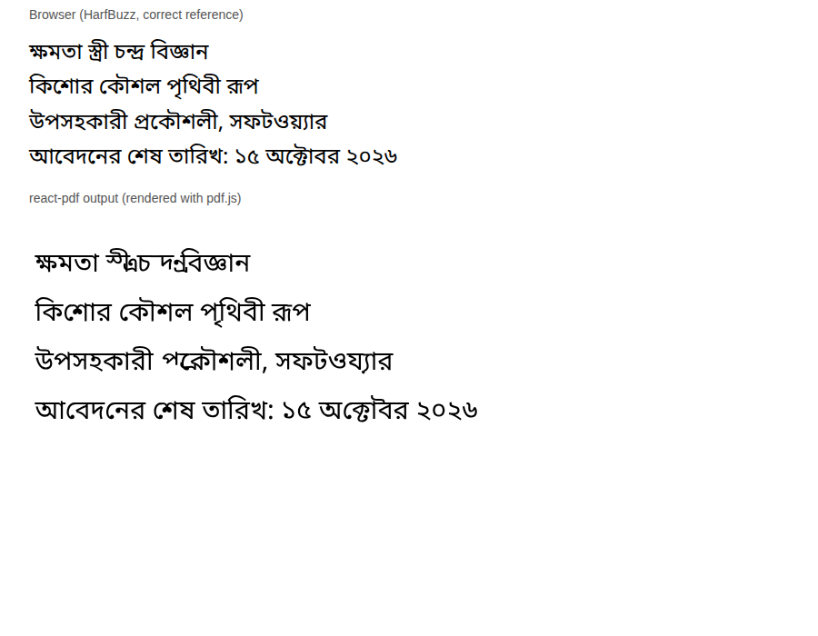

# Spike: can the PDF engine print a Bangla CV? (29 September 2026)

**Question (SPEC §11):** does react-pdf, which makes every ResumeX PDF, shape Bengali text
correctly, so a Bangla CV can be offered?

**How it was tested:** the same four lines, set in Noto Sans Bengali, rendered twice: by the
browser (HarfBuzz, the correct reference) and by react-pdf (the PDF read back with pdf.js).

**Result: not good enough.**

| Works in react-pdf | Broken in react-pdf |
| --- | --- |
| Simple letters, Bangla digits (১৫, ২০২৬) | ra-phala conjuncts: স্ত্রী, চন্দ্র, প্রকৌশলী come out scrambled |
| Most two-letter conjuncts (ক্ষ, জ্ঞ, ক্ট) | |
| Vowel signs that sit before the letter (কি, কৌ, শে) | |

Words like প্রকৌশলী (engineer) and চন্দ্র are common in names, titles and addresses, so a
Bangla CV made this way would look wrong to exactly the people it's for.

**Decision:**

- **Don't offer a Bangla CV** built on the current PDF engine. Keep it on the V2.1 list.
- **The way to do it later:** print a Bangla template as HTML through the browser (the
  browser shapes Bengali correctly, as the top half shows), or render on a server with
  Chromium. Both are separate from the 52 react-pdf templates, so it's a contained project.
- **Now:** resumes and biodata stay in English. Bangla typed into a resume shows as missing
  characters, because none of the template fonts has Bengali letters. The builder should say
  so when someone types Bangla (it does: a notice above the editor). Bangla *input* elsewhere
  (job circulars, "Add anything") is unaffected: that text never goes into a PDF.
